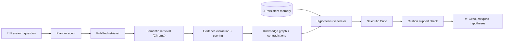

<div align="center">

# 👋 Hey, I'm Ayesha!

### AI/ML Engineer | Healthcare AI & Clinical ML | Published Researcher

**Building explainable, evidence-grounded AI systems for healthcare and risk**


[](https://www.linkedin.com/in/mohammad-ayesha-summaiyya-b94351333)
[](https://portfolio-clean-sigma.vercel.app/)
[](mailto:msumaiya03579@gmail.com)
[](https://doi.org/10.5281/zenodo.22976451)

</div>

---

## 🚀 What I Do

I build ML systems that **explain themselves**: models that show *why* they predicted something, and AI assistants that show *which evidence* backs an answer.

**Specialty:** Explainable ML · RAG & multi-agent systems · Clinical and risk analytics · End-to-end deployment (API → Docker → CI)

---

## 🧬 Flagship Project: [BioGenesis](https://github.com/Ayesha037/biogenesis)

**An evidence-aware, multi-agent biomedical research assistant.**
Ask a research question → it retrieves PubMed papers, extracts and scores evidence, builds a knowledge graph, and three agents produce **cited, critiqued hypotheses**, with memory that persists across sessions.



✅ **Citations are verified, not just present.** A separate entailment pass checks that each cited source really supports the claim
✅ **Contradictions are surfaced** in the knowledge graph and reported as a normalized rate
✅ **Honest evaluation.** Automated, LLM-judged, and human metrics are never blended, and missing gold labels are never faked
✅ **Built like research.** 3 baselines + 6 single-flag ablations on one code path, with tests enforcing it
✅ **65 offline tests** · **$0 stack** (Groq, ChromaDB, sentence-transformers, NetworkX, SQLite)

**Tech:** Python, Groq, PubMed E-utilities, ChromaDB, sentence-transformers, NetworkX, SQLite, pytest

> 🔧 **Status:** research prototype. Benchmark expansion (8 → 30–50 questions) and baseline-vs-ablation comparison in progress. Not a clinical decision-support tool.

---

## 🏥 Featured Projects

| 🏥 MediGuard AI<br>**Predictive maintenance for hospital equipment**<br>[📂 Code](https://github.com/Ayesha037/MediGuard-AI)<br>✅ Predicts failures of ventilators, MRI scanners, infusion pumps<br>✅ 100 devices · full year of telemetry<br>✅ XGBoost + LightGBM + Isolation Forest<br>✅ SHAP "top 5 reasons" behind every alert<br>✅ Docker Compose + GitHub Actions CI<br>**Tech:** FastAPI, XGBoost, LightGBM, SHAP, Docker | 🧪 AMR Leakage Study<br>**Does accuracy survive leakage-free evaluation?**<br>[📂 Code](https://github.com/Ayesha037/AMR-Project) \| [📄 Preprint](https://doi.org/10.5281/zenodo.22976451)<br>✅ 4 classifiers × 4 evaluation regimes<br>✅ 801 BV-BRC observations<br>✅ Accuracy **0.824 → 0.406** (random split vs. leave-one-species-out)<br>✅ First-author preprint<br>**Tech:** scikit-learn, XGBoost, SHAP |
| ------------------------------------------------------------------------------------------------------------------------------------------------------------------------------------------------------------------------------------------------------------------------------------------------------------------------------------------------------------------- | -------------------------------------------------------------------------------------------------------------------------------------------------------------------------------------------------------------------------------------------------------------------------------------------------------------------------------------- |
| 🔐 RAG Document Assistant<br>**Retrieval-augmented Q&A as an API**<br>[🔗 Live Demo](https://rag-chatbot-danjpg2yc4taeeerwzsvyp.streamlit.app/) \| [📂 Code](https://github.com/Ayesha037/rag-chatbot)<br>✅ 6-endpoint REST API<br>✅ Sub-10s response time<br>✅ $0 inference cost (open-source LLMs)<br>**Tech:** LangChain, FAISS, LLaMA3, Groq, FastAPI | 🕸️ GraphShield<br>**Fraud-ring detection on transaction networks**<br>[📂 Code](https://github.com/Ayesha037/GraphShield)<br>✅ node2vec embeddings<br>✅ Community detection for anomalous clusters<br>✅ Interactive graph visualization<br>**Tech:** Python, node2vec, graph analytics |
| 👁️ Safety Monitor<br>**Real-time industrial hazard detection**<br>[📂 Code](https://github.com/Ayesha037/safety_monitor)<br>✅ Computer vision pipeline<br>✅ Real-time detection<br>**Tech:** OpenCV, PyTorch | 🎯 Lead Scoring ML Model<br>**Explainable account prioritization**<br>[🔗 Live Demo](https://leadscoringproject-4zdbml2fauqqo9kwyzbc2p.streamlit.app/) \| [📂 Code](https://github.com/Ayesha037/lead_Scoring_project)<br>✅ XGBoost + Random Forest<br>✅ SHAP explanations<br>✅ Plain-English reports for non-technical users<br>**Tech:** scikit-learn, XGBoost, Streamlit |

<details>
<summary><b>📦 More projects</b></summary>

- 🌍 [India Air Quality Intelligence](https://github.com/Ayesha037/India-air-quality-Intelligence-system): live AQI monitoring with automated Excel reports and alerts · [Live](https://airqualityintelligencesystem-5yx8ooqywlmh9syyyecvht.streamlit.app/)
- 📈 [Ad Campaign Analytics](https://github.com/Ayesha037/ad_campaign_project): automated multi-channel reporting (CTR, ROAS, CPL) · [Live](https://adcampaignproject-zv64ginbqxbrkvf2yffdlj.streamlit.app/)
- 💳 [Credit Card Fraud Detection](https://github.com/Ayesha037/credit-card-fraud-detection): Python, SQL, and ML classifiers
- 🧠 [Mental Health Support (demo)](https://github.com/Ayesha037/MENTAL_HEALTH_SUPPORT): emotion analysis and crisis-keyword detection · *demo only, not a clinical tool*

</details>

---

## 📊 Key Achievements

| Achievement | Detail |
| ----------- | ------ |
| 🧬 **First-Author Preprint** | AMR prediction accuracy falls 0.824 → 0.406 under leakage-free evaluation |
| 📚 **2 Publications** | Zenodo preprint (first author) + ISJEM lung-cancer recurrence paper (lead author) |
| 🏥 **100 Devices · 1 Year** | Telemetry behind MediGuard AI failure prediction |
| 🧪 **65 Tests · 9 Configs** | BioGenesis experiment framework (3 baselines + 6 ablations) |
| 💸 **$0 Inference** | RAG assistant and BioGenesis run on open-source / free-tier stack |
| 🚀 **4 Live Demos** | RAG, Lead Scoring, Ad Campaign, Air Quality, plus the portfolio site |

---

## 🔬 Research & Publications

**Apparent Performance of Antimicrobial Resistance Phenotype Prediction Depends on the Definition of an Unseen Observation**
📖 Zenodo preprint · First author · 2026
🔗 [DOI: 10.5281/zenodo.22976451](https://doi.org/10.5281/zenodo.22976451)

**ML-Based Prediction of Recurrence in Non-Small Cell Lung Cancer**
📖 International Scientific Journal of Engineering and Management (ISJEM) · Lead author · April 2026
🔗 [DOI: 10.55041/ISJEM06362](https://doi.org/10.55041/ISJEM06362)

---

## 🛠️ Tech Stack

**ML & Explainability**


**GenAI & Agents**


**Backend, Data & DevOps**


---

## 🎯 Open For

- 🤖 **ML Engineer / Associate ML Engineer** roles
- 🧠 **AI / GenAI Engineer** roles (RAG, agents, evaluation)
- 🏥 **Healthcare AI & Clinical ML** teams
- 🛡️ **Fintech risk & fraud analytics** teams
- 📖 **Research collaborations & open source**

---

## 🌟 How I Work

```
Question → Evidence → Build → Evaluate honestly → Explain → Ship
```

1. **Evaluate before I celebrate.** I test under the strictest split I can defend and report the number that survives.
2. **Explain every prediction.** SHAP, source traceability, and citation checks are part of the design, not an afterthought.
3. **Ship it.** Docker, CI, tests, and a live demo, not just a notebook.
4. **Write the limitations down.** Every serious repo I publish has a "Known limitations" section.

---

## 🤝 Let's Connect

**Open to:** Full-time ML / AI Engineer roles · Research collaborations · Coffee chats ☕

📧 **Email:** <msumaiya03579@gmail.com>
🔗 **LinkedIn:** [Connect with me](https://www.linkedin.com/in/mohammad-ayesha-summaiyya-b94351333)
🌐 **Portfolio:** [See my work](https://portfolio-clean-sigma.vercel.app/)
💻 **GitHub:** [Explore my code](https://github.com/Ayesha037)

<div align="center">

### 🚀 Hiring for ML or AI in healthtech or risk? Let's talk.

</div>
